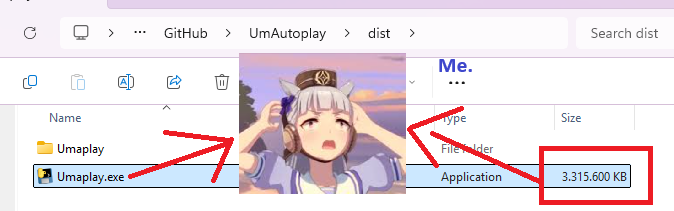
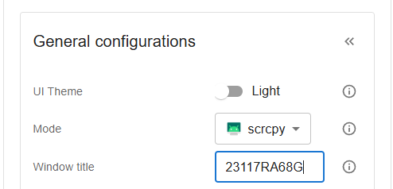
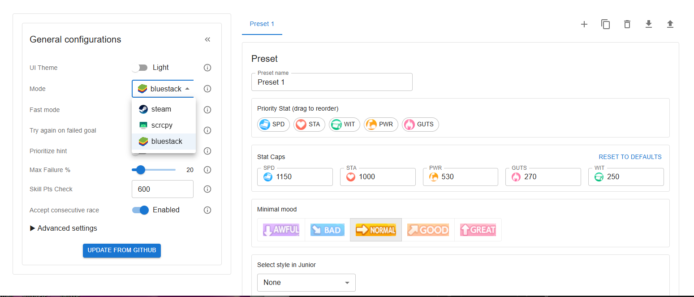
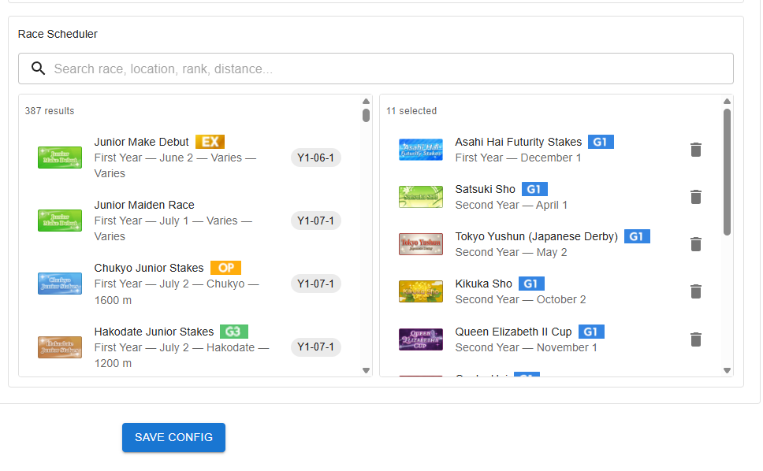
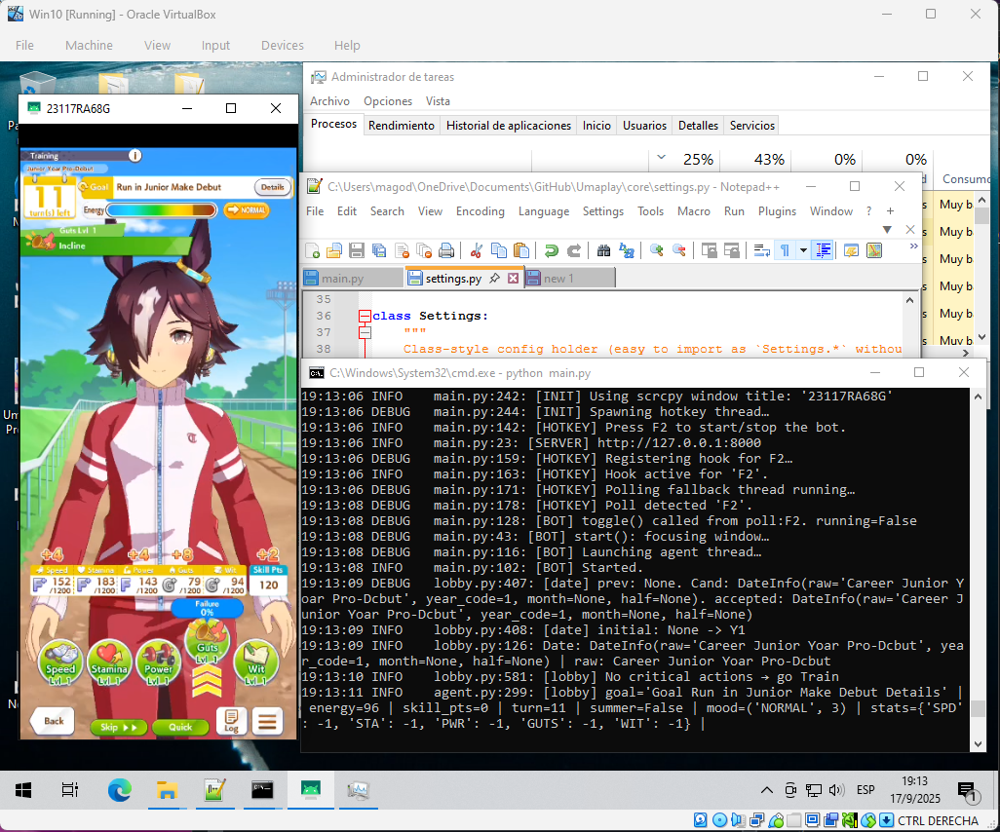
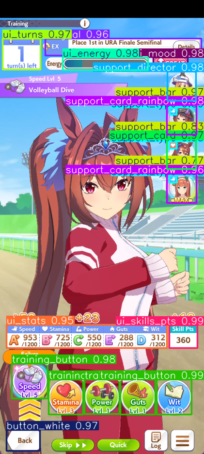
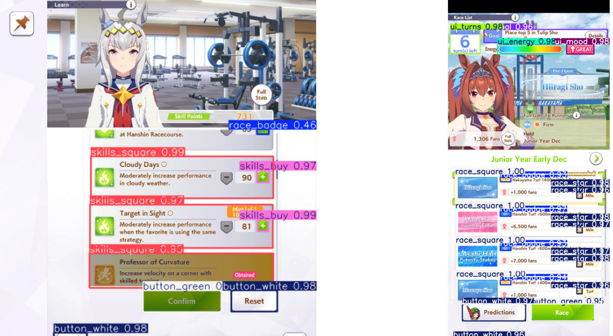
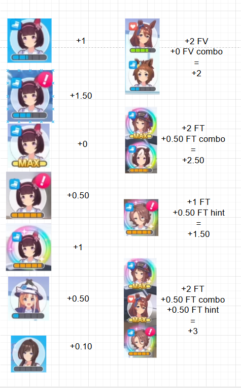
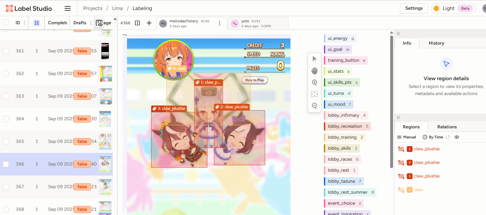

# Umamusume Auto Train

This project is an **AI bot for Umamusume: Pretty Derby** that automates training, races, and skill management. It helps you **farm fans, clear goals, and optimize stats** without grinding manually.

It works on **Steam (PC)** and **Android (via scrcpy)**, using a mix of **YOLO object detection, machine learning, OCR, and custom logic** to play like a human.  

Whether you want to **auto race G1s, plan a training schedule, or run 24/7 farming**, this tool provides a flexible and safe way to streamline your Umamusume career runs.

It’s based on and improved from:

* [shiokaze/UmamusumeAutoTrainer](https://github.com/shiokaze/UmamusumeAutoTrainer)
* [samsulpanjul/umamusume-auto-train](https://github.com/samsulpanjul/umamusume-auto-train)


---
## 💬 Discord
Wanna drop a quick thought, idea, or just hang out? Come say hi either in Issues section or in discord:

<p align="left">
  <a href="https://discord.gg/JtJfuADDYz" target="_blank">
    
  </a>
  <a href="https://discord.gg/JtJfuADDYz" target="_blank">
    https://discord.gg/JtJfuADDYz
  </a>
</p>

---

## ⚠️ Disclaimer

Use this bot **at your own risk**.
I take no responsibility for bans, issues, or account losses that may result from using it.

---

## ✨ Features

Here’s a reduced and clearer version of your features list, with the **Web UI** part expanded to highlight its capabilities (like race scheduling presets, presets management, etc.):

---

## ✨ Features

* **Smart Training**: Uses a point system (rainbows, Etsuko, director, hints, etc.) to choose the best option based on full status and state, not just faces.
* **Human-like Movements**: Randomized clicks, delays, and jitters to mimic natural input and avoid anti-cheat detection.
* **Status Tracking**: Monitors mood, stats, skill points, goals, and energy, prioritizing undertrained stats.
* **Health & Energy**: Automatically rests or visits the infirmary when needed.
* **Race Scheduling**: Plan and schedule races in advance for fan farming or goals.
* **Skill Management**: Auto-purchases and prioritizes selected skills.
* **Race Selection**: Picks optimal races with adaptive logic.
* **Goal Handling**: Supports event-specific goals (e.g., Oguri Cap G1).
* **Flexible Styles**: Choose starting racing style (front, pace, late, end).
* **Resolution Independent**: Works across different screen resolutions (tested on PC 1920x1080 + 1377x720 and Android via scrcpy) with a custom YOLO model trained on 300+ images.
* **Claw Machine Event**: Supports triggering the claw mini-game (improvements planned).
* **Hint Hunting**: Prioritizes hints when enabled in settings.
* **Web UI**:
  * Manage presets (stat caps, training priorities, minimal mood, racing style).
  * Race scheduling presets (select and save favorite races for multiple runs).
  * Toggle advanced settings (failure %, fast mode, hints priority, etc.).
  * Switch modes easily (Steam, scrcpy, Bluestacks).
  * Update bot directly from GitHub with a single click.

---

### Before You Start

Make sure you meet these conditions:

* Disable all in-game confirmation pop-ups in settings.
* Start from the **career lobby screen** (the one with the Tazuna hint icon).

---

## 🚀 Getting Started

### Installation

#### Installation with Python and Conda

Requirements:
* [Python 3.10+](https://www.python.org/downloads/)
* (Optional but recommended) [Conda](https://docs.conda.io/en/latest/)

```bash
git clone https://github.com/Magody/Umaplay.git
cd Umaplay

# Create and activate environment
conda create -n env_uma python==3.10
conda activate env_uma

# Install dependencies
pip install -r requirements.txt
```

If you face OCR errors, reinstall **paddle** and **paddleocr**:

```bash
pip uninstall -y paddlepaddle paddlepaddle-gpu paddlex paddleocr 
python -m pip install paddlepaddle
python -m pip install "paddleocr[all]"
python -m pip install paddlex
```

Then run:
```bash
python main.py
```

* Press **F2** to **start/stop** the bot.

---

#### (experimental) Installation with pre-created script

Clone the repo and just open/run the file: **run_uma.bat**. No Conda stuff, everything should be automatically installed in 'venv'. Very straightforward but it can fail. So better follow the previous instructions.

---

#### Future: Working on creating releases when versioning

I'm trying to precompile everything in a Windows executable, but I still recommend you to use the first option with python and Conda; this will allow you to easily have the last version.

(Because I'm not able to reduce the size of this exe yet; specially for 'torch')



---


### Android

#### Scrcpy (Recommended)
Scrcpy is a tool to 'mirror' your Android screen, and emulate 'touchs' over it and it requires developer mode.
- Download Scrcpy [Official Repo scrcpy](https://github.com/Genymobile/scrcpy/releases).
- You MUST enable the USB debugging (Security Settings), so the program can emulate the input; making this solution 99.9% undetectable by any anti-cheat (Although I also set a kind of human behaviour when clicking).
- Follow the instructions in [scrcpy readme](https://github.com/Genymobile/scrcpy)

Once it is installed, you only need to set 'scrcpy' option and save config in http://127.0.0.1:8000/ (read WEB UI section)
**Important**: Don't forget to set the window title, in my case for Redmi 13 Pro the title is '23117RA68G'



#### BlueStacks
I created a version for Bluestacks, you only need to set 'bluestacks' option and save config in http://127.0.0.1:8000/ (read WEB UI section). But I didn't tested enough here, I recommend you to use Scrcpy is lighter and more "native".

---

## WEB UI
You can change the configuration at http://127.0.0.1:8000/


You can set:
- **General configurations** (window title, modes, fast mode, advanced settings)
- **Presets** (target stats, priority stats, moods, skills, race scheduler)
- **Responsive layout**: left = General, right = Presets (collapsible)
- **Save config**: persists changes to `config.json` in the repo root (via backend API)
- **Schedule races**:

---

## Known Issues

I tested it in Laptop without GPU and only 8GB RAM and worked, but a little bit slower. Hardware shouldn't be a problem though; of course it works better if you have a GPU. Nevertheless I found some problems when:
- Choosing a character very different from my training dataset (It will be solved later retraining YOLO model with more data)
- Using a slow internet connection: specially in RACES; if internet is very slow the sleep counter will break all the syncronization
- Sometimes is unable to select a race even if there is only one race (goal). It happens because race may not have enough starts (Haru Urara Arima Kinen for example, or one where you have 'B' aptitude)
- Gold Ship restricted training may not work yet.

## Running as 'client' only

Ideal for running on other machines that may be *slow* or *outdated* (such as my laptop and my Vitual Machine in Virtual Box).

The `server\main_inference.py` file is designed to **offload all graphical processing**. This means that whether you’re using an older laptop or running from a virtual machine, you can simply run the following command on your main (powerful) machine:

```bash
uvicorn server.main_inference:app --host 0.0.0.0 --port 8001
```

Then, from your laptop or virtual machine (on the same network), you just need to enable the **Use external processor** option in the Web UI (set it to `True`) and provide your host URL (e.g., `http://192.168.1.5:8001`).

On the *client* side, you only need the dependencies listed in `requirements_client_only.txt`—no need to install heavy libraries like Torch or YOLO—because all processing is redirected to the `server.main_inference:app` backend running on a separate machine.

This feature is still experimental, but in my experience, it works quite well.


## Running in GPU
Follow the instructions in [README.gpu.md](README.gpu.md)

---

## Running inside Virtual Box

When running inside a **virtual machine** (in the background so you can still use your mouse on the host), it is recommended to limit resources for smoother performance.

Follow the instructions in [README.virtual_machine.md](README.virtual_machine.md)




---

## 🧠 AI Behind the Bot

The bot uses multiple AI components to make decisions:

* **YOLO Object Detection**
  Recognizes 40+ in-game objects (buttons, support cards, stats, badges, etc.).
  Trained on 1000+ labeled screenshots.

  
  

* **Logistic Regression Classifier**
  Detects whether buttons are active or inactive.

* **OCR (PaddleOCR)**
  Reads numbers, goals, and text with fallback logic.

* **Scoring System**
  Evaluates training tiles based on support cards, rainbows, hints, and risk.

  

* **Label Studio Dataset**
  All models trained with high-quality labels across multiple resolutions.

  

---

## 🤝 Contributing

* Found a bug? Open an issue.
* Want to improve? Fork the repo, create a branch, and open a Pull Request into the **dev** branch.

All contributions are welcome!

---

## Tags

*Umamusume Auto Train*, *Umamusume Pretty Derby bot*, *Uma Musume automation*, *auto-training AI bot*, *Umamusume race bot*, *YOLO OCR bot for Umamusume*, *AI game automation*, *scrcpy Umamusume bot*, *Steam Umamusume auto trainer*, *Python Umamusume AI project*, *open source Umamusume bot*, *Umamusume AI automation tool*, *AI-powered gacha game assistant*, *race farming bot*, *skill farming automation*, *Umamusume AI trainer*, *auto play Umamusume*.
