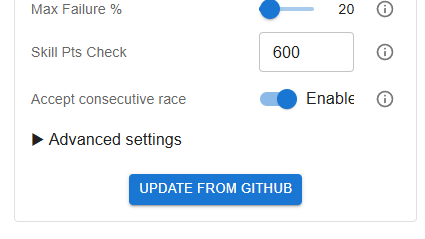
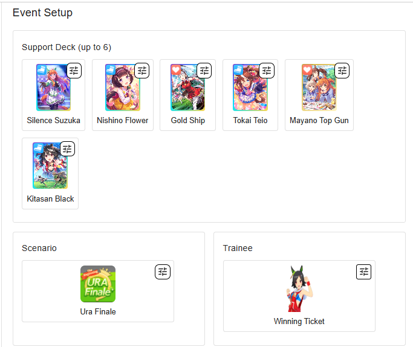
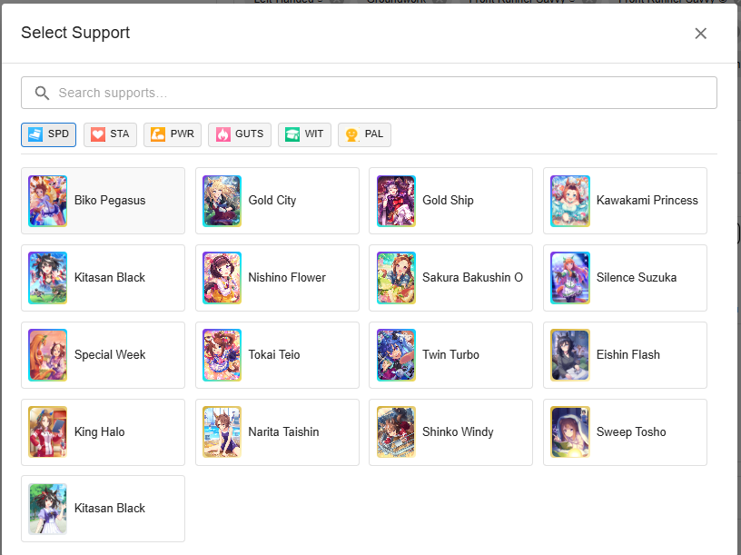
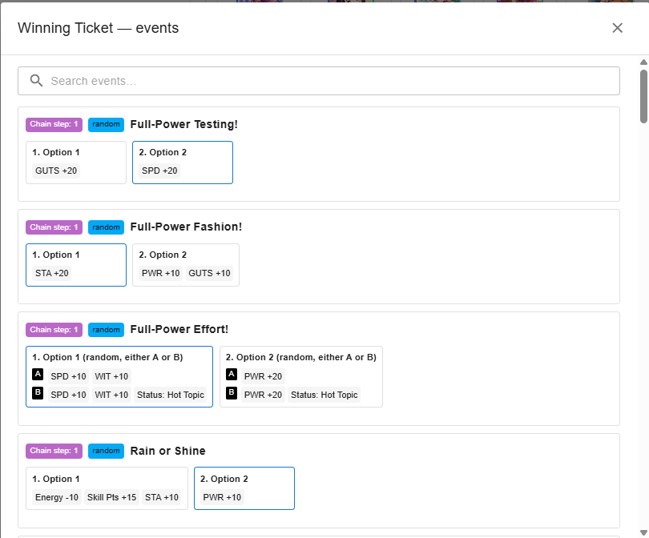
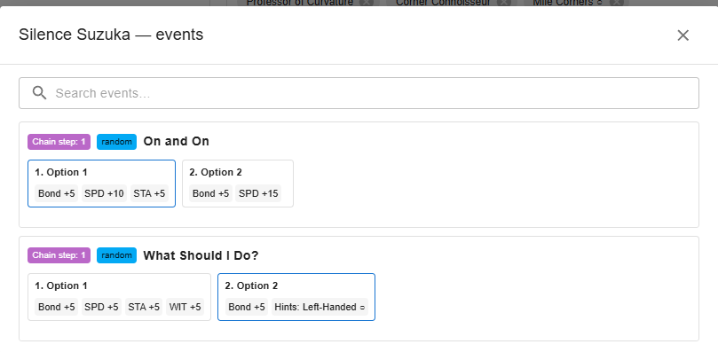

# Umamusume Auto Train

This project is an **AI bot for Umamusume: Pretty Derby** that automates training, races, and skill management. It helps you **farm fans, clear goals, and optimize stats** without grinding manually.

It works on:

- **Steam (PC)**, check a full run in: https://www.youtube.com/watch?v=smNZnwD1QI4
- **Android (via scrcpy)**, check a full run in https://www.youtube.com/watch?v=sD9CjXORIUM (inside Virtual Machine)

It is using a mix of **YOLO object detection, machine learning, OCR, and custom logic** to play like a human.  

Whether you want to **auto race G1s, plan a training schedule, or run 24/7 farming**, this tool provides a flexible and safe way to streamline your Umamusume career runs.

It’s based on and improved from:

* [shiokaze/UmamusumeAutoTrainer](https://github.com/shiokaze/UmamusumeAutoTrainer)
* [samsulpanjul/umamusume-auto-train](https://github.com/samsulpanjul/umamusume-auto-train)


---
## 💬 Discord
Wanna drop a quick thought, idea, or just hang out? Come say hi either in Issues section or in discord:

<p align="left">
  <a href="https://discord.gg/JtJfuADDYz" target="_blank">
    
  </a>
  <a href="https://discord.gg/JtJfuADDYz" target="_blank">
    https://discord.gg/JtJfuADDYz
  </a>
</p>

---

## ⚠️ Disclaimer

Use this bot **at your own risk**.
I take no responsibility for bans, issues, or account losses that may result from using it.

---

## ✨ Features

* **Smart Training** – Chooses the best option using a point system (rainbows, director, hints, etc.).
* **Human-like Input** – Random clicks, delays, and jitters to stay natural.
* **Full Tracking** – Monitors mood, stats, skills, goals, and energy.
* **Health & Energy** – Rests or uses the infirmary automatically.
* **Events** – Event option selector and character-specific overrides.
* **Races** – Schedule in advance and auto-pick optimal races.
* **Skills** – Buys and prioritizes selected skills automatically.
* **Goals & Styles** – Handles special goals and lets you set racing style.
* **Cross-Platform** – Works on PC (Steam) and Android (scrcpy/Bluestacks); resolution independent but OCR works better on bigger resolutions.
* **Claw Machine** – Supports the claw mini-game.
* **Hints** – Prioritize skill hints when enabled.
* **Web UI** – Manage presets (stats, races, events), adjust advanced settings, switch modes, and update directly from GitHub.
* **Auto Team Trials** – Automatically plays Team Trials (still experimental) with F7 hotkey, handles shop purchases and session resume. You need to be in the race screen where the team trials, room match, daily races are.
* **Auto Daily Races** – Automates daily races (still experimental) with F8 hotkey, manages shop purchases and session resume. You need to be in the race screen where the team trials, room match, daily races are.

---

### Before You Start

Make sure you meet these conditions:

* Disable all in-game confirmation pop-ups in settings.
* Start from the **career lobby screen** (the one with the Tazuna hint icon).
* Set in Umamusume config **Center Stage** (Race recommendations)
* It works on the primary display only, don't move the game to second screen.
* GPU optimization is described in another README file, it is only available for NVIDIA GPU cards
---

## 🚀 Getting Started

### Installation

#### Installation with Python and Conda

Requirements:
* [Git](https://git-scm.com/downloads)
* [Python 3.10+](https://www.python.org/downloads/)
* (Optional but recommended) [Anaconda](https://www.anaconda.com/download/success)

```bash
git clone https://github.com/Magody/Umaplay.git
cd Umaplay

# Create and activate environment
conda create -n env_uma python==3.10
conda activate env_uma

# Install dependencies
pip install -r requirements.txt
```

If you face OCR errors, reinstall **paddle** and **paddleocr**:

```bash
pip uninstall -y paddlepaddle paddlepaddle-gpu paddlex paddleocr 
python -m pip install paddlepaddle
python -m pip install "paddleocr[all]"
python -m pip install paddlex
```

Then run:
```bash
python main.py
```

* Press **F2** to **start/stop** the bot.

---

#### Updating the project
I usually push new updates, bug fixes, etc. To update just run these commands:
```bash
git reset --hard
git pull
pip install -r requirements.txt
```

Reset hard is just in case you modified some files. Pip install may be needed because I could install new libraries.

Good news, you (maybe) can use this button in WEB UI to pull from github directly also there is another button to 'force' the update. You still need to restart the full script after that:



---

#### (experimental) Installation with pre-created script

Clone the repo and just open/run the file: **scripts/run_uma.bat**. No Conda stuff, everything should be automatically installed in 'venv'. Very straightforward but it can fail. So better follow the previous instructions.

---

#### Future: Working on creating releases when versioning

I'm trying to precompile everything in a Windows executable, but I still recommend you to use the first option with python and Conda; this will allow you to easily have the last version.

(Because I'm not able to reduce the size of this exe yet; specially for 'torch')


---


### Android

#### Scrcpy (Recommended)
Scrcpy is a tool to 'mirror' your Android screen, and emulate 'touchs' over it and it requires developer mode.
- Download Scrcpy [Official Repo scrcpy](https://github.com/Genymobile/scrcpy/releases).
- You need **developer mode** (usually you get this by tapping multiple times the android version in the phone settings).
- You MUST enable the USB debugging (Security Settings), so the program can emulate the input; making this solution 99.9% undetectable by any anti-cheat (Although I also set a kind of human behaviour when clicking). Then you need to connect the phone through USB to the PC or VM.
- In general, follow the instructions in [scrcpy readme](https://github.com/Genymobile/scrcpy) to properly setup this.

Once it is installed, you only need to set 'scrcpy' option and save config in http://127.0.0.1:8000/ (read WEB UI section)
**Important**: Don't forget to set the window title, in my case for Redmi 13 Pro the title is '23117RA68G'


#### BlueStacks
I created a version for Bluestacks, you only need to set 'bluestacks' option and save config in http://127.0.0.1:8000/ (read WEB UI section). But I didn't tested enough here, I recommend you to use Scrcpy is lighter and more "native".

---

## WEB UI
You can change the configuration at http://127.0.0.1:8000/


**Important: Don't forget to press 'Save Config' button**

You can set:
- **General configurations** (window title, modes, fast mode, advanced settings)
- **Presets** (target stats, priority stats, moods, skills, race scheduler)
- **Responsive layout**: left = General, right = Presets (collapsible)
- **Save config**: persists changes to `config.json` in the repo root (via backend API).
- **Events selector**: Like in Gametora, to can select the card but also you can 'tweak' the event option (it is still experimental, but it worked for me):








- **Schedule races**:

---

## Known Issues

I tested it in Laptop without GPU and only 8GB RAM and worked, but a little bit slower. Hardware shouldn't be a problem though; of course it works better if you have a GPU. Nevertheless I found some problems when:
- Choosing a character very different from my training dataset (It will be solved later retraining YOLO model with more data)
- Using a slow internet connection: specially in RACES; if internet is very slow the sleep counter will break all the syncronization
- Gold Ship restricted training may not work yet.

## Running as 'client' only

Ideal for running on other machines that may be *slow* or *outdated* (such as my laptop and my Vitual Machine in Virtual Box).

The `server\main_inference.py` file is designed to **offload all graphical processing**. This means that whether you’re using an older laptop or running from a virtual machine, you can simply run the following command on your main (powerful) machine:

```bash
uvicorn server.main_inference:app --host 0.0.0.0 --port 8001
```

Then, from your laptop or virtual machine (on the same network), you just need to enable the **Use external processor** option in the Web UI (set it to `True`) and provide your host URL (e.g., `http://192.168.1.5:8001`).

On the *client* side, you only need the dependencies listed in `requirements_client_only.txt`—no need to install heavy libraries like Torch or YOLO—because all processing is redirected to the `server.main_inference:app` backend running on a separate machine.

This feature is still experimental, but in my experience, it works quite well.


## Running in GPU
Follow the instructions in [README.gpu.md](docs/README.gpu.md)

---

## Running inside Virtual Box

When running inside a **virtual machine** (in the background so you can still use your mouse on the host), it is recommended to limit resources for smoother performance.

Follow the instructions in [README.virtual_machine.md](docs/README.virtual_machine.md)


---

## 🧠 AI Behind the Bot

The bot uses multiple AI components to make decisions:

* **YOLO Object Detection**
  Recognizes 40+ in-game objects (buttons, support cards, stats, badges, etc.).
  Trained on +300 labeled screenshots.

  
  

* **Logistic Regression Classifier**
  Detects whether buttons are active or inactive.

* **OCR (PaddleOCR)**
  Reads numbers, goals, and text with fallback logic.

* **Scoring System**
  Evaluates training tiles based on support cards, rainbows, hints, and risk.

  

* **Label Studio Dataset**
  All models trained with high-quality labels across multiple resolutions.

  

---

## 🆕 Changelog (latest)

**:rocket: Umaplay v0.2.0 — Major Update!**

**Highlights**

**[NEW] Auto Team Trials Bot (Alpha)**
* Start with **F7**
* Handles shop purchases
* Supports session resume

**[NEW] :horse_racing: Auto Daily Races Bot (Alpha)**
* Start with **F8**
* Handles shop purchases
* Supports session resume

**AI YOLO Model Updates**
* Retrained with **100+ new images**
* Better detection of **rainbows** and **support cards**
* Added detection for **support_tazuna** card
* Created new AI model for Team Trials

**:dart: Training Strategy / Policy**
* *Undertrain stat % threshold* now configurable in **Web UI** (default: 6%)
* Improved decision making for top 3 stats
* Option to **disable races** if no good options
* Smarter **summer training** (avoids energy overcap)
* Improved Tazuna card recreation handling

**:date: Race Scheduler Fixes**
* Fixed detection for similar events (e.g., *Tokyo Yushun* vs *Japanese Oaks*)
* Better handling of "varies" race conditions from Gametora DB
* Fixed issue where ~75% of scheduled races were skipped

**Skill Buying Improvements**
* Optimized interval checks to reduce unnecessary checks

**:globe_with_meridians: Web UI Enhancements**
* Moved **hint configuration** to presets
* Wired custom **failure % / minimal auto rest %** settings
* Browser now auto-opens

**General Bug Fixes**
* Trainee event options now properly override global settings
* Improved event text matching
* Added **automatic cleanup** for debug folder if >250 MB at startup

### Next up (v0.3.0 Roadmap)
1. **New cards/trainings**: Automate integration with ChatGPT pipeline
2. **Skill buying**: Improve title recognition and prevent double purchases
3. **Team trials**: Better stale state handling
4. **Bot Strategy**: Hint support priority, race skipping for rainbows, and more


---

## 🤝 Contributing

* Found a bug? Open an issue.
* Want to improve? Fork the repo, create a branch, and open a Pull Request into the **dev** branch.

All contributions are welcome!

---

## 💖 Support the Project

If you find this project helpful and would like to support its development, consider making a donation. Your support motivates further improvements! Also let me know on discord if you have a very specific requirement.

[](https://buymeacoffee.com/magody)
[](https://paypal.me/MagodyBoy)

Every contribution, no matter how small, is greatly appreciated! Thank you for your support! ❤️

## Tags

*Umamusume Auto Train*, *Umamusume Pretty Derby bot*, *Uma Musume automation*, *auto-training AI bot*, *Umamusume race bot*, *YOLO OCR bot for Umamusume*, *AI game automation*, *scrcpy Umamusume bot*, *Steam Umamusume auto trainer*, *Python Umamusume AI project*, *open source Umamusume bot*, *Umamusume AI automation tool*, *AI-powered gacha game assistant*, *race farming bot*, *skill farming automation*, *Umamusume AI trainer*, *auto play Umamusume*.
