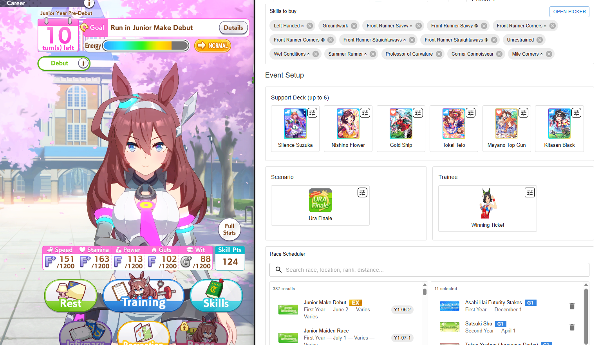

# Umamusume Auto Train

This project is an **AI bot for Umamusume: Pretty Derby** that automates training, races, and skill management. It helps you **farm fans, clear goals, and optimize stats** without grinding manually.

It works on **Steam (PC)** and **Android (via scrcpy)**, using a mix of **YOLO object detection, machine learning, OCR, and custom logic** to play like a human.  

Whether you want to **auto race G1s, plan a training schedule, or run 24/7 farming**, this tool provides a flexible and safe way to streamline your Umamusume career runs.

It’s based on and improved from:

* [shiokaze/UmamusumeAutoTrainer](https://github.com/shiokaze/UmamusumeAutoTrainer)
* [samsulpanjul/umamusume-auto-train](https://github.com/samsulpanjul/umamusume-auto-train)



---

## ⚠️ Disclaimer

Use this bot **at your own risk**.
I take no responsibility for bans, issues, or account losses that may result from using it.

---

## ✨ Features

* **Smart Training**: Chooses the best option using a point system (rainbows, Etsuko, director, hints, etc.), the decision depends on all collected status and state; not most faces only. In my main account my Ura finale completion rate is 100% for about 60 automatic runs I did; Although in my free-to-play account without MLB or good parents my win rate is around 90% on 30 automatic runs I did. 
* **Organic and human movements**: In order to avoid any anti-cheat stuff I implemented a module that uses random numbers to emulate human behaviour when doing clicks and movements (jitter delays also).
* **Status Tracking**: Collects mood, stats, skill points, goals, and energy %. It also checks if a stat is 'undertrained' and prioritizes it.
* **Health & Energy**: Rests or goes to the infirmary automatically when needed.
* **Race Scheduling**: Plan races ahead of time (for fan farming or goals).
* **Skill Management**: Auto-purchases and prioritizes selected skills.
* **Race Selection**: Picks optimal races with smart decision logic.
* **Auto handle goals**: Included Oguri Cap G1 goal
* **Flexible Style**: Set your starting racing style (front, pace, late, end).
* **Screen Resolution Independent**: Works on almost any screen resolution using a custom YOLO model trained with 1000+ images. I tested in 1980x1080 and 1377x720 and Android with Scrcpy in Redmi 13 Pro
* **Claw Machine Event**: Can trigger the claw mini-game (improvements planned).
* **Hint hunting**: If you set in Settings the HINT_IS_IMPORTANT to True, then the bot will prioritize the hints.
---

## 🚀 Getting Started

### Requirements

* [Python 3.10+](https://www.python.org/downloads/)
* (Optional but recommended) [Conda](https://docs.conda.io/en/latest/)

### Installation

```bash
git clone https://github.com/Magody/Umaplay.git
cd Umaplay

# Create and activate environment
conda create -n env_uma python==3.10
conda activate env_uma

# Install dependencies
pip install -r requirements.txt
```

If you face OCR errors, reinstall **paddle** and **paddleocr**:

```bash
pip uninstall -y paddlepaddle paddlepaddle-gpu paddlex paddleocr 
python -m pip install paddlepaddle
python -m pip install "paddleocr[all]"
python -m pip install paddlex
```

---

### Before You Start

Make sure you meet these conditions:

* Disable all in-game confirmation pop-ups in settings.
* Start from the **career lobby screen** (the one with the Tazuna hint icon).

### Android
Scrcpy is a tool to 'mirror' your Android screen, and emulate 'touchs' over it and it requires developer mode.
- Download Scrcpy [Official Repo scrcpy](https://github.com/Genymobile/scrcpy/releases).
- You MUST enable the USB debugging (Security Settings), so the program can emulate the input; making this solution 99.9% undetectable by any anti-cheat (Although I also set a kind of human behaviour when clicking).
- Follow the instructions in [scrcpy readme](https://github.com/Genymobile/scrcpy)

---

### Configuration

Open `main.py` and choose your controller:

* **Steam** (PC):

  ```python
  ctrl = SteamController("Umamusume")
  ```

* **Android via scrcpy**:

  ```python
  window_title = "23117RA68G"  # Replace with your scrcpy device ID
  ctrl = ScrcpyController(window_title)
  ```

Then configure your player setup, including race plan, skills, and style (I'm still working on a WEB UI to provide a experience similar to GameTora).

For now for races please use the same text name defined in [races.json](datasets/in_game/races.json) which is inside 'datasets/ingame' in this repo:

```python
self.player = Player(
    ctrl=ctrl,
    ocr=ocr,
    interval_stats_refresh=3,
    minimum_skill_pts=800,
    auto_rest_minimum=26,
    # Plan races MUST follow this format for <YEAR>-<MONTH>-<HALF> (half can only be 1 or 2)
    plan_races={
        "Y1-12-1": "Asahi Hai Futurity Stakes",
        "Y2-05-1": "NHK Mile Cup",
        "Y2-05-2": "Japanese Oaks",
        "Y3-03-2": "Osaka Hai",
        "Y3-05-1": "Victoria Mile",
        "Y3-11-2": "Japan Cup",
    },
    skill_list=[
        "Groundwork", "Focus", "Leader's Pride", "Professor of Curvature",
        "Homestretch Haste", "Summer Runner", "Left Handed",
        "Front Runner Corners", "Front Runner Straightaways",
        "Front Runner Savvy", "Sunny Days", "Wet Conditions",
        "Tokyo Racecourse", "Standard Distance"
    ],
    # Set None if not needed
    select_style="front"
)
```

---

### Running the Bot

```bash
python main.py
```

* Press **F2** to **start/stop** the bot.

---

### Known Issues

I tested it in Laptop without GPU and only 8GB RAM and worked, but a little bit slower. Hardware shouldn't be a problem though; of course it works better if you have a GPU. Nevertheless I found some problems when:
- Choosing a character very different from my training dataset (It will be solved later retraining YOLO model with more data)
- Using a slow internet connection: specially in RACES; if internet is very slow the sleep counter will break all the syncronization
- Sometimes is unable to select a race even if there is only one race (goal). It happens because race may not have enough stars (Haru Urara Arima Kinen for example, or one where you have 'B' aptitude)
- Gold Ship restricted training may not work yet.

## 🧠 AI Behind the Bot

The bot uses multiple AI components to make decisions:

* **YOLO Object Detection**
  Recognizes 40+ in-game objects (buttons, support cards, stats, badges, etc.).
  Trained on 1000+ labeled screenshots.

  
  

* **Logistic Regression Classifier**
  Detects whether buttons are active or inactive.

* **OCR (PaddleOCR)**
  Reads numbers, goals, and text with fallback logic.

* **Scoring System**
  Evaluates training tiles based on support cards, rainbows, hints, and risk.

  

* **Label Studio Dataset**
  All models trained with high-quality labels across multiple resolutions.

  

---

## 🤝 Contributing

* Found a bug? Open an issue.
* Want to improve? Fork the repo, create a branch, and open a Pull Request into the **dev** branch.

All contributions are welcome!

---

## 📌 Notes

* Works best with characters included in the training dataset (Oguri, Daiwa, McQueen, Taiki, Haru Urara, etc.).
* For others, detection accuracy may vary — feel free to report issues.

## Tags

*Umamusume Auto Train*, *Umamusume Pretty Derby bot*, *Uma Musume automation*, *auto-training AI bot*, *Umamusume race bot*, *YOLO OCR bot for Umamusume*, *AI game automation*, *scrcpy Umamusume bot*, *Steam Umamusume auto trainer*, *Python Umamusume AI project*, *open source Umamusume bot*, *Umamusume AI automation tool*, *AI-powered gacha game assistant*, *race farming bot*, *skill farming automation*, *Umamusume AI trainer*, *auto play Umamusume*.
