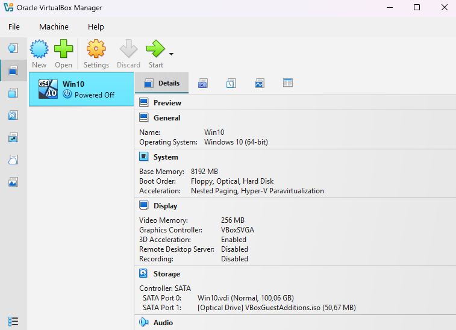
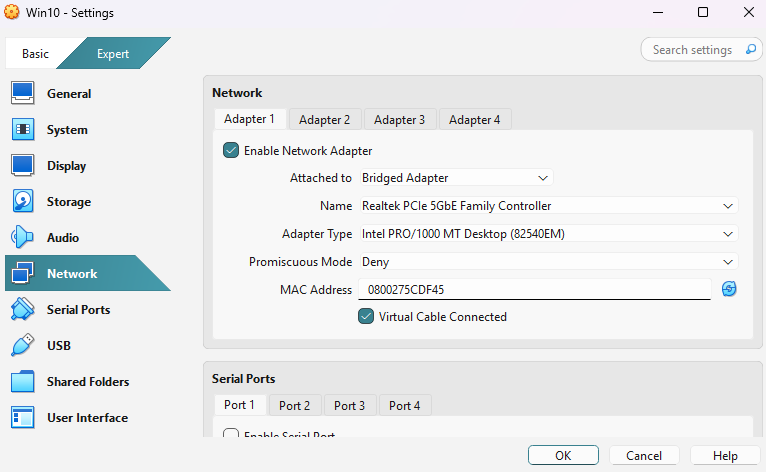
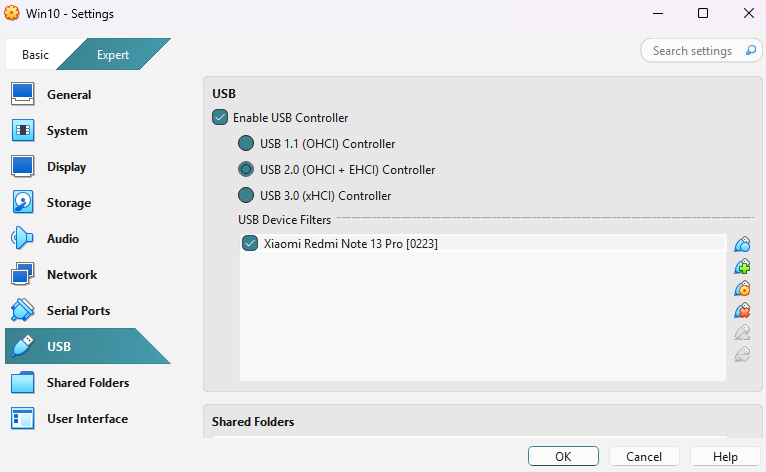

# Running scrcpy in a Virtual Machine

When running inside a **virtual machine** (in the background so you can still use your mouse on the host), it is recommended to limit resources for smoother performance:

- **Memory:** 8 GB RAM  
- **CPU:** 2 cores

---

## 1. (Optional) Enable GPU Rendering
Force hardware GPU rendering instead of software:

```powershell
set SDL_RENDER_DRIVER=direct3d
```

---

## 2. Run scrcpy with Low CPU Usage

You don’t need high FPS for automation or vision tasks.
Run scrcpy with these options so you save resources:

```bash
scrcpy --max-fps 10 -b 2M --video-codec=h264 --no-audio
```

### Explanation of flags:

* `--max-fps 5–15` → Limits FPS, fewer frames to decode and draw.
* `--no-audio` → Disables audio capture/decoding thread.
* `--video-codec h264` → H.264 is cheaper to decode than HEVC/AV1 in a VM.
* `-b 2M` → Reduces bitrate (lower bandwidth and CPU use).

---

## 3. Networking and USB Setup

* Set **Network Adapter** to **Bridge mode** so the VM is on the same network as your host.
* Enable **USB forwarding** so scrcpy inside the VM can access your phone.

---

## 4. Using the GPU in host while you run in Virtual Box

The file: server\main_inference.py, is made to expose endpoints to process YOLO and OCR stuff. So if in your VM you set the IP of your running host main_inference.py, and in settings (in VM) you set:
USE_EXTERNAL_PROCESSOR = True
EXTERNAL_PROCESSOR_URL = "http://YOUR HOST IP:8001"

You will be able to have the best of both worlds: a separated mini computer running and playing the game, and that mini computer will be using your main GPU and host power. This may be a little advanced stuff. Maybe I document more details about this later...

## 5. My Virtual Box configurations






## 6. Usage Tips

* Follow the same [scrcpy installation instructions](https://github.com/Genymobile/scrcpy).
* You can minimize the VM window while scrcpy runs in the background.
* This lets you **continue working on your host machine** while scrcpy stays active inside the VM.

---
